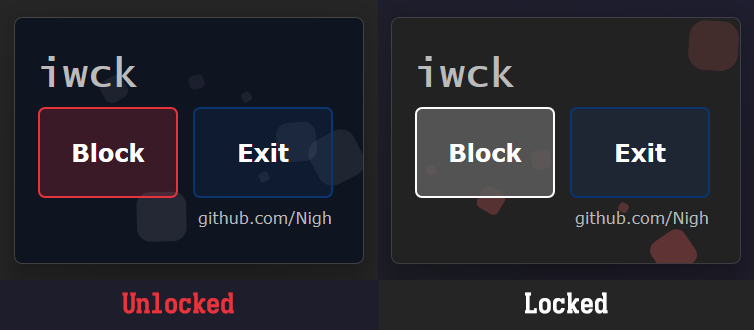

I-wanna-clean-keyboard
======================

This app won't clean your keyboard... but it could block the keyboard input when you were cleaning the keyboard...

---

This must be a app I wrote with the least code.

- press `Block` to block your keyboard.

- press `Block` to unblock when the button is gray

- press `Exit` to unblock your keyboard and exit the app.

I'm wrong...

    > This must be a app I wrote with the least code.

The ui accounted for 99% of the code while funtion may accounts just for less than 1%...QAQ
